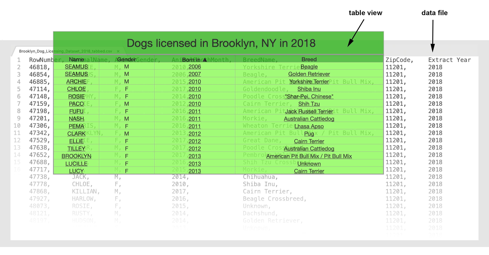

## d3-tabulator
A standalone ES6-native module based on [D3.js](https://www.d3js.org). Useful for generating a simple interactive table view from D3-compatible data files.

### Features
d3_tabulator is based on the concept of table views, which define how to represent a data file in tabular form.



Views currently support:
- Displaying a title
- Defining column headers
- Sortable columns
- Filtering rows by column
- Rounding numeric columns

### Usage
d3_tabulator simply requires D3.js v5+ to be included, along with d3_tabulator.js (minified version [here](https://github.com/ryansc0tt/d3_tabulator/master/module/min/d3_tabulator.min.js)). Then
```
import d3_tabulator from './path/to/d3_tabulator.min.js'
```
for use in your Javascript.

To display a table with a `d3_tabulator` instance:
1. Load the data from file(s) via `.load_data()`
2. Optionally, create a custom view with `.create_view()` - see samples and docs for reference.
3. Tabulate - a D3 [selection](https://github.com/d3/d3-selection) object is returned from `.tabulate_view()`
4. Append the returned table `.node()` to your HTML.

Note that since D3.js is used to generate the table rows, it can also be used to access the corresponding data - enabling further data-driven interactions. For example, with `table` returned from `tabulate_view()`,
``` 
table
.select('tbody')
.selectAll('tr[style*="visibility: visible"]')
.data()
```
will return the  data joined to all currently visible rows in the table (including any columns that may be excluded from the current view).

Two **samples** are provided. [brooklyn_dogs/](https://github.com/ryansc0tt/d3_tabulator/tree/master/samples/brooklyn_dogs) displays a default table view  from a single data file. [brooklyn_dogs_with_view/](https://github.com/ryansc0tt/d3_tabulator/tree/master/samples/brooklyn_dogs_with_view) creates a more user-friendly, customized view first.

A more practical implementation utilizing multiple data files is live here: [Overclocked Remix YouTube Playlist Generator](http://ryansmiddleton.com/playlistgenerator)
 
Module **documentation** can be found in [doc/](https://github.com/ryansc0tt/d3_tabulator/tree/master/doc).
